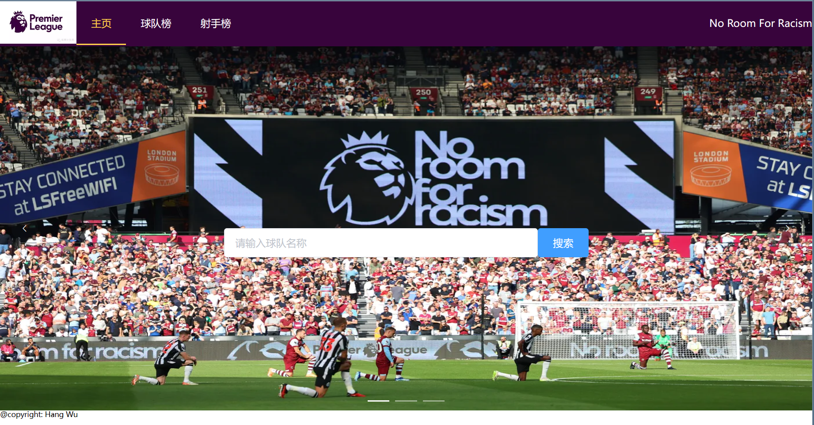
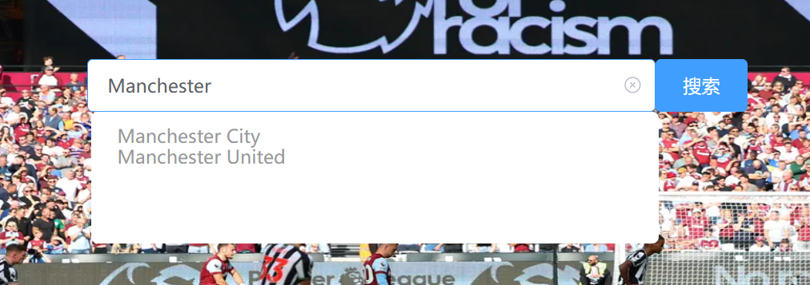
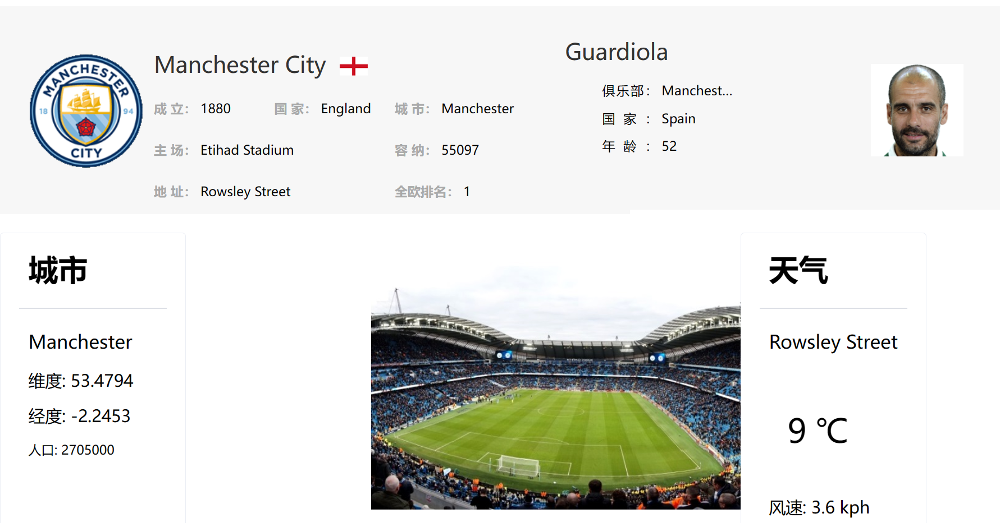
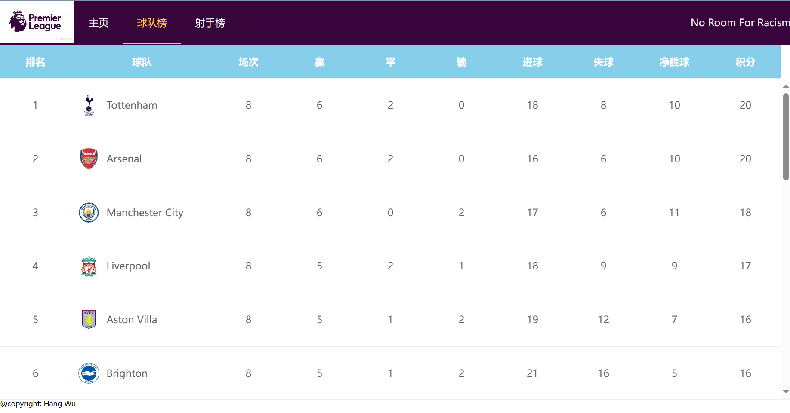
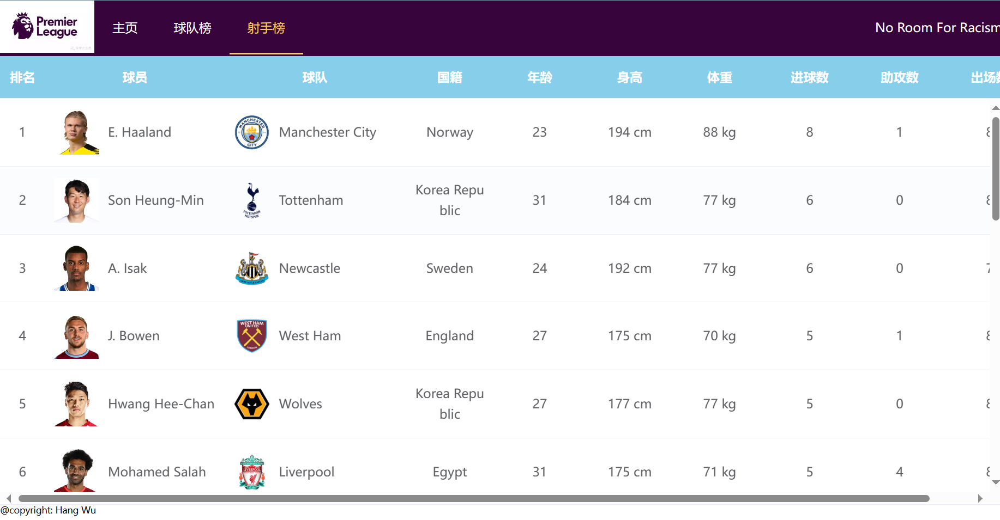

##  README

使用vue搭建的简易英超赛事信息平台，通过调用现有api的方式获取数据，没有进行后端的编写

使用的api列表：

| api          | url                                             | 功能                 |
| ------------ | ----------------------------------------------- | -------------------- |
| api-football | https://www.api-football.com/documentation-beta | 获取球队信息         |
| weather      | https://www.weatherapi.com/docs/                | 获取当地天气         |
| rankings     | https://rapidapi.com/fluis.lacasse/api/footapi7 | 获取球队在全球的排名 |
| city         | https://api-ninjas.com/api/city                 | 获取城市信息         |

包含三个主要模块： 

* 搜索模块：输入正确的球队名称，页面会跳转并显示球队及主教练信息
* 球队模块：按照积分显示球队排名
* 球员模板：按照进球数显示球员

以下是效果演示：

主页

在搜索框中输入内容时会有相关提示

搜索得到的结果页面

球队榜

球员榜

